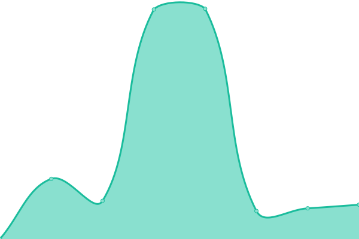

# [📈 Live Status](https://FinexTechnology.github.io/uptime): <!--live status--> **🟩 All systems operational**

This repository contains the open-source uptime monitor and status page for [FinexTechnology](https://FinexTechnology.github.io/uptime), powered by [Upptime](https://github.com/upptime/upptime).

With [Upptime](https://upptime.js.org), you can get your own unlimited and free uptime monitor and status page, powered entirely by a GitHub repository. We use [Issues](https://github.com/FinexTechnology/uptime/issues) as incident reports, [Actions](https://github.com/FinexTechnology/uptime/actions) as uptime monitors, and [Pages](https://FinexTechnology.github.io/uptime) for the status page.

<!--start: status pages-->
<!-- This summary is generated by Upptime (https://github.com/upptime/upptime) -->
<!-- Do not edit this manually, your changes will be overwritten -->
<!-- prettier-ignore -->
| URL | Status | History | Response Time | Uptime |
| --- | ------ | ------- | ------------- | ------ |
|  [İşte Bu Doktor](http://istebudoktor.com.tr/) | 🟩 Up | [iste-bu-doktor.yml](https://github.com/FinexTechnology/uptime/commits/HEAD/history/iste-bu-doktor.yml) | 

 1773ms
     
 | 

<a href="https://FinexTechnology.github.io/uptime/history/iste-bu-doktor">100.00%</a>
    

|  [İşte Bu Veteriner](http://istebuveteriner.com.tr/) | 🟩 Up | [iste-bu-veteriner.yml](https://github.com/FinexTechnology/uptime/commits/HEAD/history/iste-bu-veteriner.yml) | 

 925ms
     
 | 

<a href="https://FinexTechnology.github.io/uptime/history/iste-bu-veteriner">100.00%</a>
    

|  [İşte Bu Avukat](http://istebuavukat.com.tr/) | 🟩 Up | [iste-bu-avukat.yml](https://github.com/FinexTechnology/uptime/commits/HEAD/history/iste-bu-avukat.yml) | 

 841ms
     
 | 

<a href="https://FinexTechnology.github.io/uptime/history/iste-bu-avukat">100.00%</a>
    

|  [İşte Bu Okul](http://istebuokul.com.tr/) | 🟩 Up | [iste-bu-okul.yml](https://github.com/FinexTechnology/uptime/commits/HEAD/history/iste-bu-okul.yml) | 

 937ms
     
 | 

<a href="https://FinexTechnology.github.io/uptime/history/iste-bu-okul">100.00%</a>
    

|  [İşte Bu Firma](http://istebufirma.com.tr/) | 🟩 Up | [iste-bu-firma.yml](https://github.com/FinexTechnology/uptime/commits/HEAD/history/iste-bu-firma.yml) | 

 1140ms
     
 | 

<a href="https://FinexTechnology.github.io/uptime/history/iste-bu-firma">100.00%</a>
    

<!--end: status pages-->

[**Visit our status website →**](https://FinexTechnology.github.io/uptime)

## 📄 License

- Powered by: [Upptime](https://github.com/upptime/upptime)
- Code: [MIT](./LICENSE) © [Anand Chowdhary](https://anandchowdhary.com), supported by [Pabio](https://pabio.com)
- Data in the `./history` directory: [Open Database License](https://opendatacommons.org/licenses/odbl/1-0/)
